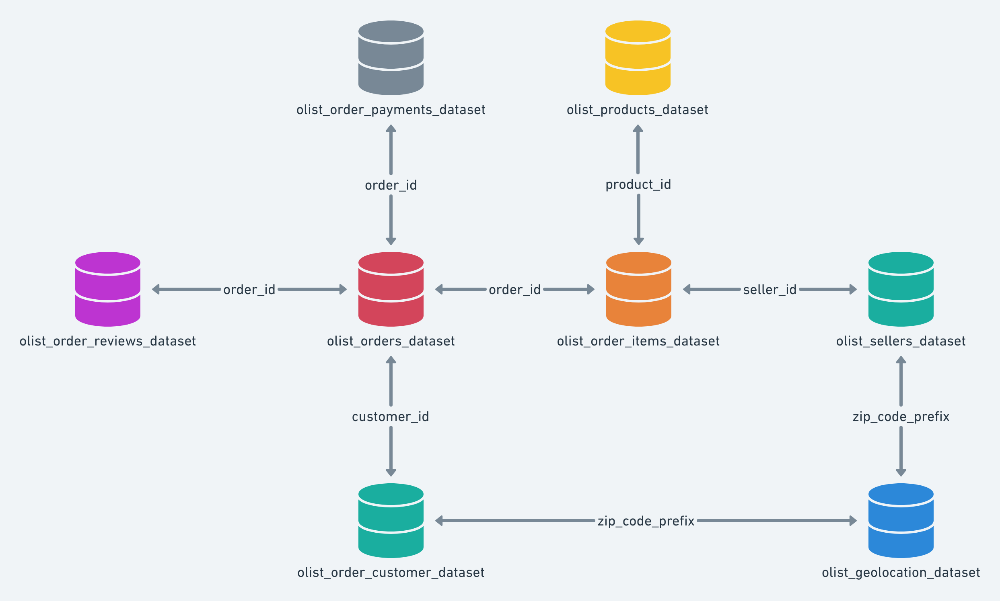

# SQL-Olist-E-Commerce-Analytics-Project
End-to-end SQL Server (T-SQL) project on the Olist Brazilian e-commerce dataset: data cleaning, joins, window functions, business analysis, views, stored procedures, and indexing.

# Olist E-Commerce SQL Analysis

End-to-end SQL project on the Olist Brazilian e-commerce dataset using **Microsoft SQL Server (T-SQL)**: from schema design and data cleaning to business analysis, views, stored procedures, and indexing.

## Business Problem
Olist connects small sellers with customers across Brazil. This project answers: *How are sales trending? How good is delivery performance and does it affect reviews? Who are the top sellers and customers? Are customers coming back?*

## Dataset
[Brazilian E-Commerce Public Dataset by Olist (Kaggle)](https://www.kaggle.com/datasets/olistbr/brazilian-ecommerce) — 9 CSV files, ~99K orders.

Tables: orders, customers, order_items, payments, reviews, products, sellers, geolocation, category_translation.

## Tools
- Microsoft SQL Server + SSMS
- SSMS Import/Export Wizard
- T-SQL

## ERD


## Project Workflow
1. **Schema design** – composite PKs for order_items/payments/reviews, CHAR(32) for hashed IDs, DECIMAL for money
2. **Data import** – handled misspelled columns, long review text, and UTF-8 encoding corruption (re-imported with Code Page 65001)
3. **Data cleaning** – NULL checks, impossible date sequences, empty categories, orphan keys, outliers, geolocation dedup with `ROW_NUMBER()`
4. **Core SQL** – filtering, CASE WHEN, GROUP BY/HAVING, CTEs
5. **Advanced SQL** – all 5 join types, scalar and correlated subqueries, window functions
6. **Business analysis** – revenue, delivery, RFM, sellers, payments, retention
7. **Database objects** – views and a parameterized stored procedure
8. **Performance** – indexing with before/after measurement

## Key Findings
- **Delivery:** 8.11% of orders were delivered late. Late orders had a much lower review score (**2 vs 4** for on-time).
- **Retention:** only **2,997 customers (~3%)** made a repeat purchase, which points to low retention.
- **Regional order value:** northern/remote states have the highest average order value; São Paulo (SP) has the lowest.
- **Trends:** the reliable analysis window is **Jan 2017 – Aug 2018**. Earlier and later months are incomplete and distort growth rates.
- **Data quality:** 166 orders had impossible date sequences, 8 "delivered" orders had no delivery timestamp, and 610 products had missing categories.
- **Indexing:** a point lookup by `customer_id` dropped from **2,391 to 6 logical reads (~400x)** after indexing, while a full-table aggregate saw no benefit because every row must be read anyway.

## SQL Skills Demonstrated
| Area | Techniques |
|---|---|
| Querying | WHERE, IN, BETWEEN, LIKE, CASE WHEN, TOP, OFFSET-FETCH, DISTINCT |
| Aggregation | GROUP BY, HAVING, date grouping |
| Joins | INNER, LEFT, CROSS, FULL OUTER, self-join |
| Subqueries & CTEs | Scalar, correlated, multi-step CTEs |
| Window functions | RANK, DENSE_RANK, ROW_NUMBER, LAG, running totals, PARTITION BY |
| Database objects | Views, stored procedure with parameter |
| Optimization | Indexes, `SET STATISTICS IO` |

```

## How to Run
1. Download the dataset from Kaggle and place the CSVs locally (see `data/README.md`).
2. Create a database in SQL Server and run `sql/01_schema_design.sql`.
3. Import the CSVs using the SSMS Import/Export Wizard (see `docs/import_gotchas.md` for settings that avoid errors).
4. Run the remaining scripts in order.

## Sample Output
<!-- Add 2–3 screenshots of result sets, e.g. seller leaderboard, delivery vs review score -->

## What I Learned
- Encoding issues can be silent and need explicit code page handling during import.
- Indexes help selective lookups, not full scans.
- Partial months at dataset edges can make growth metrics misleading.

## Author
**Vanshika** — [www.linkedin.com/in/vanshika-chauhan-19249432b](#) | [vanshika.chauhan107@gmail.com](#)
